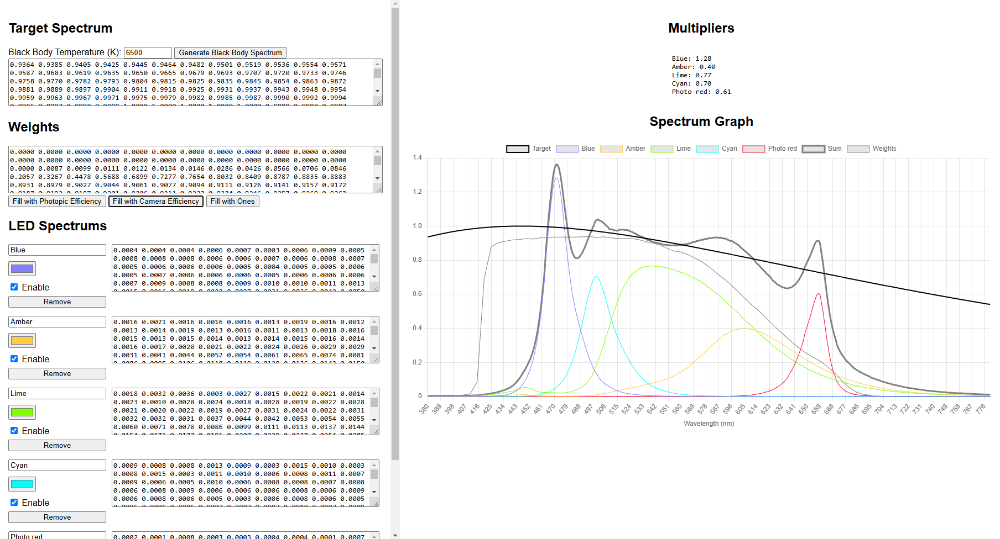

# SpectrumComposition
SpectrumComposition – A tool for fitting LED intensities to match a target spectrum. Supports black body spectrum generation, custom LED spectrums, and real-time visualization.

[GitHub Pages](https://petrSevostianov.github.io/SpectrumComposition/)

## How to Use the App

### Setting the Target Spectrum

1. **Black Body Spectrum**:
   - Enter the desired temperature in Kelvin in the "Black Body Temperature (K)" input field.
   - Click the "Generate Black Body Spectrum" button to generate and set the black body spectrum as the target spectrum.

2. **Custom Spectrum**:
   - Enter 401 space-separated values representing the spectrum in the "Target Spectrum" textarea.

### Setting the Weights

1. **Photopic Efficiency**:
   - Click the "Fill with Photopic Efficiency" button to set the weights based on the photopic efficiency function.

2. **Camera Efficiency**:
   - Click the "Fill with Camera Efficiency" button to set the weights based on the camera efficiency function.

3. **Uniform Weights**:
   - Click the "Fill with Ones" button to set all weights to one.

4. **Custom Weights**:
   - Enter 401 space-separated values representing the weights in the "Weights" textarea.

### Managing LED Spectrums

1. **Adding an LED**:
   - Click the "Add LED" button to add a new LED input section.
   - Enter the LED name, select the LED color, and enter the LED spectrum values (401 space-separated values) in the provided fields.
   - Check or uncheck the "Enable" checkbox to include or exclude the LED from the fitting process.

2. **Removing an LED**:
   - Click the "Remove" button in the LED input section to remove the LED.

### Viewing Results

1. **Multipliers**:
   - The calculated multipliers for each LED will be displayed in the "Multipliers" section.

2. **Spectrum Graph**:
   - The "Spectrum Graph" section will display the target spectrum, individual LED spectrums, and the combined spectrum.

### Saving and Loading Data

- The app automatically saves the current state to local storage every 250 milliseconds.
- When the app is loaded, it retrieves the saved state from local storage and restores the settings.

### Real-Time Updates

- The app updates the spectrum graph and multipliers in real-time as you make changes to the target spectrum, weights, or LED spectrums.

